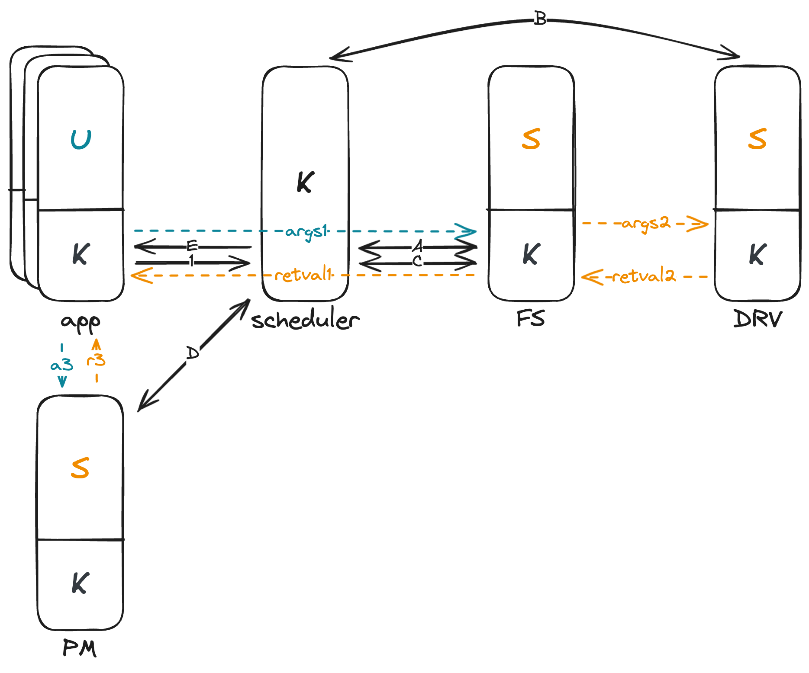

# Service

## Microkernel

Service 是 microkernel 的核心组件之一。我们先来看一下 microkernel 的定义（摘自维基百科）：

> Microkernel 的设计理念，是将系统服务的实现，与系统的基本操作规则区分开来。它实现的方式，是将核心功能模块化，划分成几个独立的进程，各自运行，这些进程被称为服务（service）。所有的 service，都运行在不同的地址空间。只有需要绝对特权的进程，才能在 S mode 下运行，其余的进程则在 U mode 运行。
>
> 这样的设计，使内核中最核心的功能，设计上变的更简单。需要特权的部分，只有基本的线程管理，内存管理和进程间通信等，这个部分，由一个简单的硬件抽象层与关键的系统调用组成。其余的服务进程，则移至用户空间。
>
> 让服务各自独立，可以减少系统之间的耦合度，易于实现与调试，也可增进可移植性。它可以避免单一组件失效，而造成整个系统崩溃，内核只需要重启这个组件，不致于影响其他服务器的功能，使系统稳定度增加。同时，操作系统也可以视需要，抽换或新增某些服务进程，使功能更有弹性。
>
> 因为所有服务进程都各自在不同地址空间运行，因此在微核心架构下，不能像宏内核一样直接进行函数调用。在微核心架构下，要建立一个进程间通信机制，通过消息传递的机制来让服务进程间相互交换消息，调用彼此的服务，以及完成同步。采用主从式架构，使得它在分布式系统中有特别的优势，因为远程系统与本地进程间，可以采用同一套进程间通信机制。

## Overview

在我们的系统中，为了简单起见，我们一共需要实现以下几个 service：

1. Scheduler (S mode)
2. Drivers (U mode) *Undetermined*
3. File system (U mode)
4. Process manager (U mode)

我们可以用一张图来总结上述 services 之间的关系：

这张图描述了一个用户程序进行 `sys_open` 的完整流程。

**开始于应用程序（App）**：

- 用户程序发起一个 `syscall` 进入内核态，并传递相关参数如 `syscall number`、`path` 和 `flags`。
- 内核态的 `syscall handler` 根据 `syscall number` 调用相应的服务。在本例中，需要获取某个路径（`path`）下的文件，因此内核线程通过 IPC 请求 **文件系统服务（File System Service）**。
- 请求发出后，内核线程进入等待状态，并切换到 **调度器（Scheduler）** 管理。

**调度器（Scheduler）过程**：

- 调度器根据任务队列和调度算法，选择下一个要执行的服务。此例中，假设它先后选择了 **文件系统服务** 和 **驱动服务（Driver Service）**。

**在文件系统服务（File System Service）**：

- 系统从内核线程切换至用户线程（U模式），**文件系统服务** 尝试根据 `path` 查找文件，并将结果返回给内核线程。
- **文件系统服务** 需要访问块设备（block device）以获得数据，因此又通过 IPC 请求 **驱动服务**。
- 请求完成后，用户线程切换回内核线程，并再次转至 **调度器**。

**再次到调度器（Scheduler）**：

- 根据当前任务队列，**调度器** 再次选择下一个要执行的任务。

**在驱动服务（Driver Service）**：

- 驱动服务操作块设备读取数据，完成后将数据返回至 **文件系统服务**。
- 数据交换完毕后，控制权再次返回 **调度器**。

**返回到文件系统服务**：

- **文件系统服务** 获取到所需数据，并最终找到文件，将文件信息传递回最初请求的 **应用程序** 的内核线程。

**回到应用程序（App）**：

- 内核线程收到文件信息，随后联系 **进程管理器（Process Manager）**，以便为文件创建一个新的文件描述符。

**在进程管理器（Process Manager）**：

- **进程管理器** 为 **应用程序** 创建并返回新的文件描述符。

**结束于应用程序（App）**：

- **应用程序** 的内核线程接收到文件描述符后，完成整个 `sys_open` 调用，并将控制权返回给用户程序。

通过这一整套流程，可以清楚地看出微内核系统中各个服务的协作方式，以及进程间通信的重要作用。
