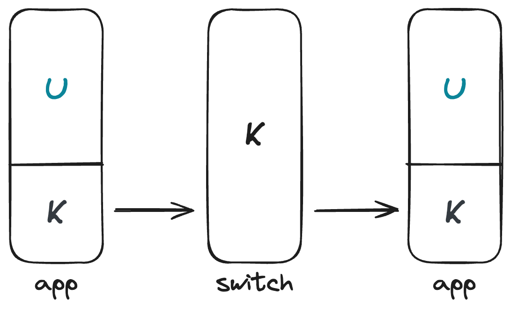

# 切换内核线程

在进入多任务之前，我们始终只有一个内核线程在运行。不过，这样我们就无法很方便地处理多用户进程的情况了。

在多用户进程的情况下，通常每个进程都有一个内核线程与之对应，这样的做法更利于调度。在调度时，我们会先让用户进程进入到内核态，然后再切换到对应的内核线程。

这里还要补充一下，我们之所以说内核线程，而非内核进程，是因为内核线程共享了地址空间。内核线程的地址空间是一样的，而它们的栈是不同的。

在这一章节中，我们会讲解如何切换内核线程。我们发现切换线程只需要保存上下文（即所有的寄存器和 `pc` 寄存器的值）即可。而且，我们注意到，由于函数调用需要遵循 calling convention，因此如果调用函数，这个函数（我们在这里称为 `switch`）专门用来切换内核进程，我们只需要将所有的 callee-saved 寄存器保存到内存中，然后再从内存恢复即可。关于 pc 寄存器，只要我们将之前调用这个切换内核线程的函数的返回地址恢复到 `ra`，那么 `ret` 的时候就会跳转到这个地址。

为了保存这些上下文信息，我们需要传入两个指针分别存放切换前后的线程上下文。

综合上面的分析，我们可以总结出 `switch` 函数需要做的事情：

1. 将 callee-saved 寄存器保存到切换前的线程上下文中；
2. 从切换后的线程上下文中恢复 callee-saved 寄存器；
3. 返回 (`ret`)。

其中，callee-saved 寄存器包括 `s0-s11`、`ra`、`sp`。

## 调度器

调度器是一个内核线程，它的主要工作是根据一定的调度算法，选择下一个要执行的内核线程。一个最简单的调度器是循环调度器，它会依次选择下一个线程。一次任务切换如下图所示：

<p align="center">
  
</p>

## 任务

我们调度的最小粒度是任务。任务是一个内核线程的抽象，它包含了线程的上下文信息，以及一些其他信息，比如任务的状态等。以下是一个任务的结构：

```rust
struct Task {
    context: TaskContext,
    state: TaskState,
    // ..., other field for scheduling or something else
 
```
